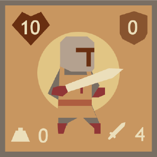

# Templar's Final Stand




> Templar's Final Stand is a mini strategy game inspired by 2048. The player takes on the role of a Templar Knight, trying to survive longer by fighting off enemies while navigating the grid.

## Tutorial

It’s October 13, 1307. King Philip IV has sent his forces to hunt you down. As one of the last Knights Templar, it’s a battle for survival!

Move across the battlefield, take down enemies, and gather powerful items. But beware - if your total load reaches 13, your triskaidekaphobia kicks in, and every step will become a painful struggle.

Each move matters, and survival depends on balancing your strategy. Let’s see how long you can last!

### Controls

- Click/Tap to make your selections.
- Use the arrows or WSAD to move up, down, left, or right on the keyboard.
- Swipe up, down, left, or right on mobile devices to move.

### Rules

- Move toward enemies or items to attack or equip.
- Combine same items to create stronger versions — except potions, which may either buff or debuff.
- Equipments (except potions) add weight, which lasts until the item's duration ends.
- At a total weight of 13 or more, every step will cause damage.

### Choose a Class

- Knight: Brave and balanced, reliable in combat.
- Wizard: Physically weak but able to use potions to attack enemies.
- Defender: Reflecting damage back to enemies with his shield.

### Know Your Enemies

- Whirlstriker: Strikes surrounding opponents.
- Guardian: High shield defense.
- Counterstriker: Retaliates against incoming attacks.
- Spearman: Penetrates through shields with attacks.
- Crossblade: Attacks in a full cross-shaped pattern.
- Lancepiercer: Penetrates shields and strikes nearby opponents.

## Contributing

### Installing Dependencies

After cloning this repo, install dependecies:

```
pnpm i
```

### Checking code format

```
pnpm check
```

### Testing the app in the browser

To test your work in your browser (with hot reloading!) while developing:

```
pnpm start
# Alternatively to test in a more advanced WebXDC emulator:
pnpm emulator
```

### Building

To package the WebXDC file:

```
pnpm build
```

To package the WebXDC with developer tools inside to debug in Delta Chat, set the `NODE_ENV`
environment variable to "debug":

```
NODE_ENV=debug pnpm build
```

The resulting optimized `.xdc` file is saved in `dist-xdc/` folder.

### Releasing

To automatically build and create a new GitHub release with the `.xdc` file:

```
git tag -a v1.0.1
git push origin v1.0.1
```

## Credits

This is a port to Webxdc of [Templar-s-Final-Stand](https://github.com/leokuo0724/Templar-s-Final-Stand) originally written by [leokuo0724](https://github.com/leokuo0724) for [js13k 2024](https://js13kgames.com/) game jam
